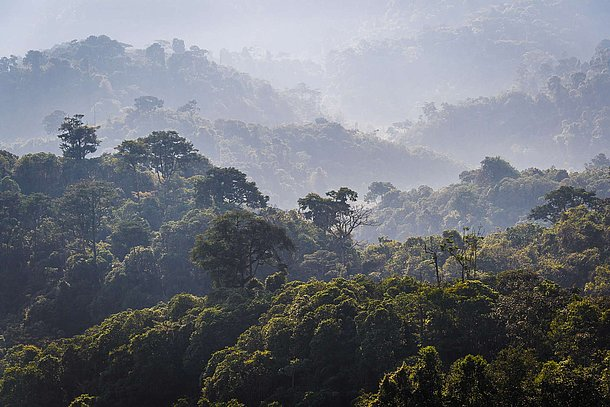

# Predicting CO2 Emissions in Rwanda - Kaggle competition project  
 

  

  

## Project goal and overview
Hi again! In this project I am doing some forecasting. It is based on Kaggle competition - [Predict CO2 Emissions in Rwanda]([https://www.kaggle.com/competitions/godaddy-microbusiness-density-forecasting/overview](https://www.kaggle.com/competitions/playground-series-s3e20/)). The ability to accurately monitor carbon emissions is a critical step in the fight against climate change. Precise carbon readings allow researchers and governments to understand the sources and patterns of carbon mass output. While Europe and North America have extensive systems in place to monitor carbon emissions on the ground, there are few available in Africa. The objective of this challenge is to create a machine learning models using open-source CO2 emissions data from Sentinel-5P satellite observations to predict future carbon emissions. These solutions may help enable governments, and other actors to estimate carbon emission levels across Africa, even in places where on-the-ground monitoring is not possible.  
  
  
Generally work is in progress
  
I am using [RMSE](https://en.wikipedia.org/wiki/Root-mean-square_deviation) to measure accuracy of models.

## Motivation
I used this project as a playground to learn machine learning regression tools. It also helped me get more familiar with sklearn framework, so in nutshell:
 - Sci-kit learn - I got familiar with its API and selecting right model,
 - Machine learning regression tools - checked mathematics behind it,
 - $LaTeX$ - fancy equations,
 - pandas, seaborn - some training in this area is always cool,  

## How to run the project
 - Download repo files,
 - Create Conda environment using environment.yml file,
 - Run the notebook - execution takes 1-2 minutes,

## Possible upgrades
More sophisticated ML tools can be used or there could be done more data analysis to find better correlations between data - for example lag features could be explored.
